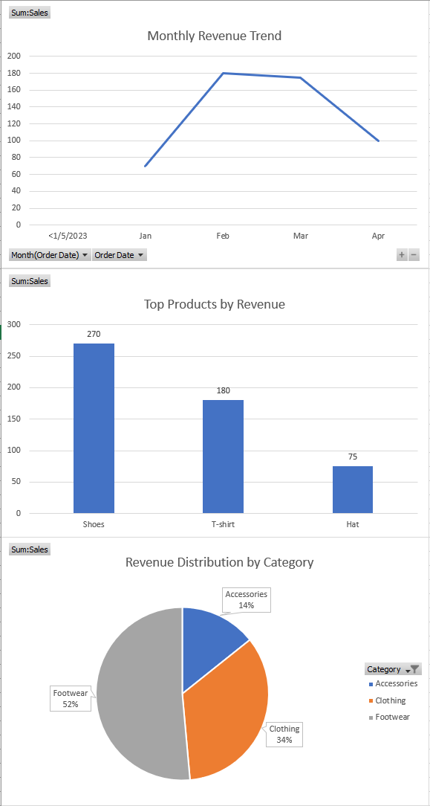

# E-commerce Analysis

## Overview
This project analyzes e-commerce sales data to identify revenue trends, product performance, and customer purchasing behavior.

## Tools Used
- SQL
- Excel

## Key Analysis
- Monthly revenue trends
- Top-performing products
- Category performance
- Customer purchasing behavior
- Customer segmentation based on purchasing behavior

## Key Insights
- A small number of products contribute the majority of revenue
- Sales show seasonal patterns across months
- High-value customers generate a large portion of total revenue

## Business Implications

- Focus on top-performing products to maximize revenue
- Adjust inventory planning based on seasonal demand trends
- Target high-value customers to improve retention and lifetime value

## Files
- sql_queries.sql: SQL code used for analysis
- dashboard.xlsx: Excel dashboard visualization

## Dashboard Preview

